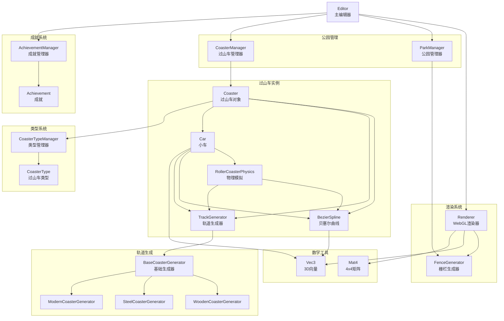
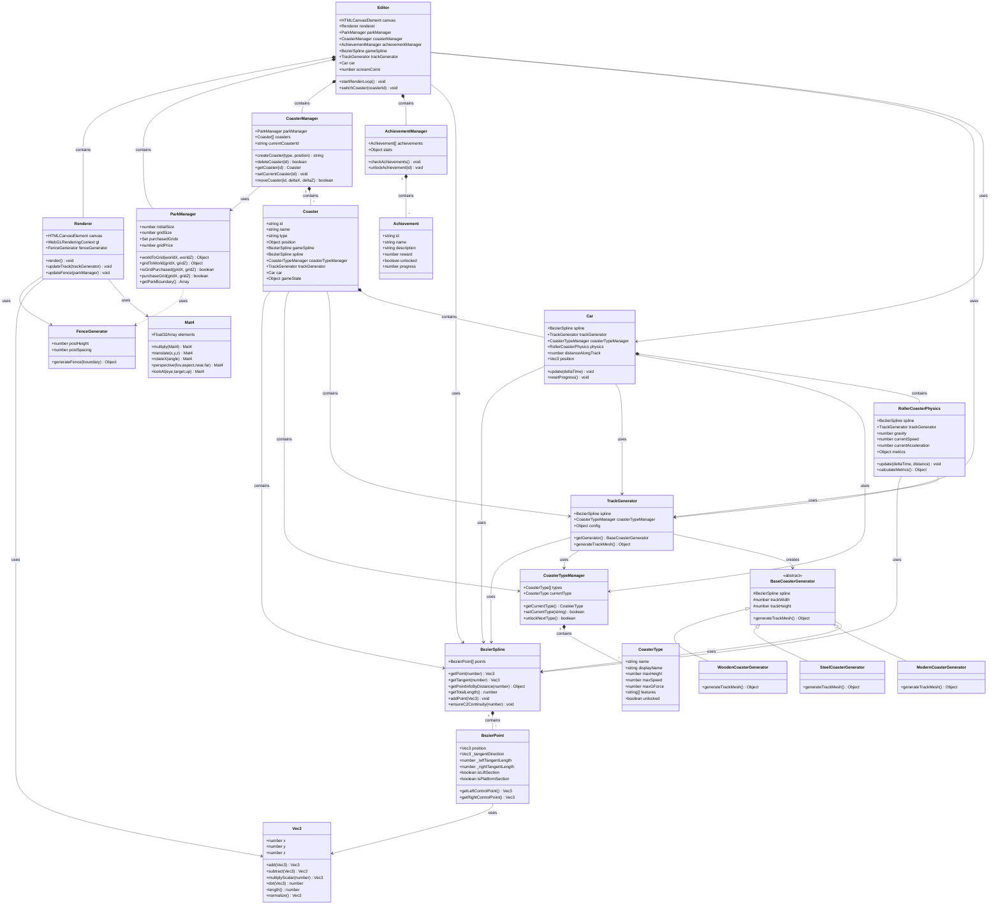

# 过山车项目 UML 类图

本文档描述了过山车项目的类结构和它们之间的关系。

## 简化架构图

## 核心模块说明

### 1. 编辑器层（Editor）
- **Editor**: 主控制器，协调所有子系统

### 2. 渲染层（Renderer）
- **Renderer**: WebGL渲染管理
- **FenceGenerator**: 栅栏网格生成

### 3. 管理层（Managers）
- **ParkManager**: 公园区域和网格管理
- **CoasterManager**: 多个过山车实例管理
- **AchievementManager**: 成就和统计管理

### 4. 过山车层（Coaster）
- **Coaster**: 单个过山车的完整数据
- **BezierSpline**: 3D曲线定义
- **TrackGenerator**: 轨道网格生成
- **Car**: 小车状态和行为
- **RollerCoasterPhysics**: 物理模拟

### 5. 生成器层（Generators）
- **BaseCoasterGenerator**: 抽象基类
- **WoodenCoasterGenerator**: 木架过山车
- **SteelCoasterGenerator**: 钢架过山车
- **ModernCoasterGenerator**: 现代过山车

### 6. 支持层（Support）
- **CoasterTypeManager**: 类型管理
- **AchievementManager**: 成就管理
- **Vec3/Mat4**: 数学工具

## 类图（Mermaid格式 - 推荐）

## 类图（PlantUML格式）

```plantuml
@startuml
!define PUBLIC + 
!define PRIVATE - 
!define PROTECTED # 

' 数学工具类
class Vec3 {
    +x: number
    +y: number
    +z: number
    +add(v: Vec3): Vec3
    +subtract(v: Vec3): Vec3
    +multiplyScalar(s: number): Vec3
    +dot(v: Vec3): number
    +cross(v: Vec3): Vec3
    +length(): number
    +normalize(): Vec3
    +copy(): Vec3
}

class Mat4 {
    +elements: Float32Array
    +multiply(m: Mat4): Mat4
    +translate(x, y, z): Mat4
    +rotateX(angle): Mat4
    +rotateY(angle): Mat4
    +rotateZ(angle): Mat4
    +scale(x, y, z): Mat4
    +perspective(fov, aspect, near, far): Mat4
    +lookAt(eye, target, up): Mat4
}

' 贝塞尔曲线系统
class BezierPoint {
    +position: Vec3
    +_tangentDirection: Vec3
    +_leftTangentLength: number
    +_rightTangentLength: number
    +isLiftSection: boolean
    +liftSpeed: number
    +isElectromagneticBoost: boolean
    +isElectromagneticBrake: boolean
    +isPlatformSection: boolean
    +getLeftControlPoint(): Vec3
    +getRightControlPoint(): Vec3
    +setLeftControlPoint(worldPos, tangentLength): void
    +setRightControlPoint(worldPos, tangentLength): void
}

class BezierSpline {
    +points: BezierPoint[]
    +getPoint(t: number): Vec3
    +getTangent(t: number): Vec3
    +getPointInfoByDistance(distance: number): Object
    +getTotalLength(): number
    +addPoint(position: Vec3): void
    +removePoint(index: number): void
    +ensureC2Continuity(index: number): void
}

' 过山车类型系统
class CoasterType {
    +name: string
    +displayName: string
    +description: string
    +maxHeight: number
    +maxSpeed: number
    +maxGForce: number
    +features: string[]
    +unlocked: boolean
}

class CoasterTypeManager {
    +types: CoasterType[]
    +currentType: CoasterType
    +getCurrentType(): CoasterType
    +setCurrentType(typeName: string): boolean
    +unlockNextType(): boolean
    +getType(typeName: string): CoasterType
}

' 轨道生成系统
abstract class BaseCoasterGenerator {
    #spline: BezierSpline
    #trackWidth: number
    #trackHeight: number
    #railHeight: number
    #crossSections: number
    #sampleInterval: number
    +generateTrackMesh(): Object
    +generateRails(): Object
}

class WoodenCoasterGenerator {
    +generateTrackMesh(): Object
}

class SteelCoasterGenerator {
    +generateTrackMesh(): Object
}

class ModernCoasterGenerator {
    +generateTrackMesh(): Object
}

class TrackGenerator {
    +spline: BezierSpline
    +coasterTypeManager: CoasterTypeManager
    +config: Object
    +generators: Object
    +getGenerator(): BaseCoasterGenerator
    +clearGeneratorCache(): void
    +generateTrackMesh(): Object
}

' 物理系统
class RollerCoasterPhysics {
    +spline: BezierSpline
    +trackGenerator: TrackGenerator
    +gravity: number
    +currentSpeed: number
    +currentAcceleration: number
    +currentDistance: number
    +frictionCoefficient: number
    +metrics: Object
    +update(deltaTime, distance): void
    +calculateMetrics(): Object
    +reset(): void
}

' 小车系统
class Car {
    +spline: BezierSpline
    +trackGenerator: TrackGenerator
    +coasterTypeManager: CoasterTypeManager
    +physics: RollerCoasterPhysics
    +distanceAlongTrack: number
    +currentPointIndex: number
    +position: Vec3
    +rotation: Mat4
    +update(deltaTime): void
    +resetProgress(): void
    +getPointInfoByDistance(distance): Object
}

' 公园管理系统
class ParkManager {
    +initialSize: number
    +gridSize: number
    +purchasedGrids: Set
    +gridPrice: number
    +centerX: number
    +centerZ: number
    +worldToGrid(worldX, worldZ): Object
    +gridToWorld(gridX, gridZ): Object
    +isGridPurchased(gridX, gridZ): boolean
    +purchaseGrid(gridX, gridZ): boolean
    +isPositionInPark(worldX, worldZ): boolean
    +getParkBounds(): Object
    +getParkBoundary(): Array
    +getPurchasableAdjacentGrids(): Array
}

class FenceGenerator {
    +postHeight: number
    +postWidth: number
    +postSpacing: number
    +railHeight: number
    +generateFence(boundary): Object
}

' 过山车管理系统
class CoasterManager {
    +parkManager: ParkManager
    +coasters: Array
    +currentCoasterId: string
    +nextId: number
    +createCoaster(type, position): string
    +deleteCoaster(id): boolean
    +getCoaster(id): Object
    +getAllCoasters(): Array
    +getCurrentCoaster(): Object
    +setCurrentCoaster(id): void
    +moveCoaster(id, deltaX, deltaZ): boolean
    +rotateCoaster(id, angle): boolean
}

' 成就系统
class Achievement {
    +id: string
    +name: string
    +description: string
    +category: string
    +icon: string
    +reward: number
    +unlocked: boolean
    +unlockedAt: Date
    +progress: number
    +target: number
}

class AchievementManager {
    +achievements: Achievement[]
    +stats: Object
    +onUnlockCallback: Function
    +checkAchievements(): void
    +updateStats(data): void
    +unlockAchievement(id): void
    +getAchievement(id): Achievement
}

' 渲染系统
class Renderer {
    +canvas: HTMLCanvasElement
    +gl: WebGLRenderingContext
    +isWebGL2: boolean
    +fenceGenerator: FenceGenerator
    +fenceMesh: Object
    +purchasableGridsMesh: Object
    +render(): void
    +updateTrack(trackGenerator): void
    +updateFence(parkManager): void
    +updatePurchasableGrids(parkManager, isBuyMode): void
    +renderFence(projectionMatrix, viewMatrix, modelMatrix): void
    +renderPurchasableGrids(projectionMatrix, viewMatrix, modelMatrix): void
}

' 主编辑器
class Editor {
    +canvas: HTMLCanvasElement
    +renderer: Renderer
    +parkManager: ParkManager
    +coasterManager: CoasterManager
    +gameSpline: BezierSpline
    +spline: BezierSpline
    +trackGenerator: TrackGenerator
    +car: Car
    +coasterTypeManager: CoasterTypeManager
    +achievementManager: AchievementManager
    +screamCoins: number
    +startRenderLoop(): void
    +onMouseDown(e): void
    +onMouseUp(e): void
    +onMouseMove(e): void
    +switchCoaster(coasterId): void
    +syncCurrentCoaster(): void
}

' 关系定义
BezierSpline "1" *-- "many" BezierPoint : contains
BezierPoint "1" --> "1" Vec3 : uses

TrackGenerator "1" --> "1" BezierSpline : uses
TrackGenerator "1" --> "1" CoasterTypeManager : uses
TrackGenerator "1" --> "1" BaseCoasterGenerator : creates

BaseCoasterGenerator <|-- WoodenCoasterGenerator
BaseCoasterGenerator <|-- SteelCoasterGenerator
BaseCoasterGenerator <|-- ModernCoasterGenerator
BaseCoasterGenerator "1" --> "1" BezierSpline : uses

CoasterTypeManager "1" *-- "many" CoasterType : contains

Car "1" --> "1" BezierSpline : uses
Car "1" --> "1" TrackGenerator : uses
Car "1" --> "1" CoasterTypeManager : uses
Car "1" --> "1" RollerCoasterPhysics : contains

RollerCoasterPhysics "1" --> "1" BezierSpline : uses
RollerCoasterPhysics "1" --> "1" TrackGenerator : uses

CoasterManager "1" --> "1" ParkManager : uses
CoasterManager "1" *-- "many" Coaster : contains

class Coaster {
    +id: string
    +name: string
    +type: string
    +position: Object
    +rotation: number
    +gameSpline: BezierSpline
    +spline: BezierSpline
    +coasterTypeManager: CoasterTypeManager
    +trackGenerator: TrackGenerator
    +car: Car
    +gameState: Object
}

Coaster "1" --> "1" BezierSpline : contains
Coaster "1" --> "1" CoasterTypeManager : contains
Coaster "1" --> "1" TrackGenerator : contains
Coaster "1" --> "1" Car : contains

ParkManager "1" --> "1" FenceGenerator : uses (indirect)

Renderer "1" --> "1" FenceGenerator : uses
Renderer "1" --> "1" Vec3 : uses
Renderer "1" --> "1" Mat4 : uses

Editor "1" --> "1" Renderer : contains
Editor "1" --> "1" ParkManager : contains
Editor "1" --> "1" CoasterManager : contains
Editor "1" --> "1" AchievementManager : contains
Editor "1" --> "1" BezierSpline : uses (current)
Editor "1" --> "1" TrackGenerator : uses (current)
Editor "1" --> "1" Car : uses (current)
Editor "1" --> "1" CoasterTypeManager : uses (current)

AchievementManager "1" *-- "many" Achievement : contains

@enduml
```

## 类说明

### 核心系统

#### Editor（编辑器）
- **职责**：主控制器，协调所有子系统
- **关键属性**：
  - `renderer`: WebGL渲染器
  - `parkManager`: 公园管理器
  - `coasterManager`: 过山车管理器
  - `achievementManager`: 成就管理器
- **关键方法**：
  - `startRenderLoop()`: 启动渲染循环
  - `switchCoaster()`: 切换当前过山车
  - `syncCurrentCoaster()`: 同步当前过山车状态

#### Renderer（渲染器）
- **职责**：WebGL渲染管理
- **关键功能**：
  - 渲染轨道、小车、栅栏
  - 管理WebGL上下文和着色器
  - 处理相机和投影矩阵

### 曲线系统

#### BezierSpline（贝塞尔样条）
- **职责**：管理3D贝塞尔曲线
- **关键功能**：
  - C2连续性保证
  - 根据参数t或距离获取点
  - 控制点管理

#### BezierPoint（贝塞尔控制点）
- **职责**：单个控制点的数据和行为
- **关键属性**：
  - `position`: 控制点位置
  - `isLiftSection`: 是否为牵引区域
  - `isPlatformSection`: 是否为站台区域

### 轨道生成系统

#### TrackGenerator（轨道生成器）
- **职责**：根据过山车类型选择合适的生成器
- **关键功能**：
  - 工厂模式创建生成器
  - 缓存生成器实例
  - 生成轨道网格数据

#### BaseCoasterGenerator（基础生成器）
- **职责**：定义生成器的通用接口
- **子类**：
  - `WoodenCoasterGenerator`: 木架过山车
  - `SteelCoasterGenerator`: 钢架过山车
  - `ModernCoasterGenerator`: 现代过山车

### 物理系统

#### RollerCoasterPhysics（物理模拟）
- **职责**：基于能量守恒的物理模拟
- **关键功能**：
  - 速度、加速度计算
  - 摩擦力、空气阻力
  - G力、特征值计算

#### Car（小车）
- **职责**：过山车小车的状态和行为
- **关键功能**：
  - 沿轨道移动
  - 物理状态更新
  - 圈数统计

### 公园管理系统

#### ParkManager（公园管理器）
- **职责**：管理公园区域和网格系统
- **关键功能**：
  - 60x60米初始区域
  - 1x1米网格购买系统
  - 边界计算和验证

#### FenceGenerator（栅栏生成器）
- **职责**：根据公园边界生成木栅栏网格
- **关键功能**：
  - 生成栅栏柱和横杆
  - 创建3D网格数据

#### CoasterManager（过山车管理器）
- **职责**：管理多个过山车实例
- **关键功能**：
  - 创建/删除过山车
  - 切换当前过山车
  - 移动和旋转过山车

### 类型系统

#### CoasterTypeManager（类型管理器）
- **职责**：管理过山车类型和解锁状态
- **类型**：
  - `wooden`: 木架过山车（默认解锁）
  - `steel`: 钢架过山车
  - `modern`: 现代过山车

### 成就系统

#### AchievementManager（成就管理器）
- **职责**：管理成就和统计数据
- **关键功能**：
  - 成就检查和解锁
  - 统计数据收集
  - 奖励发放

## 关系说明

### 组合关系（Composition）
- `Editor` 包含 `Renderer`、`ParkManager`、`CoasterManager`、`AchievementManager`
- `BezierSpline` 包含多个 `BezierPoint`
- `CoasterManager` 包含多个 `Coaster` 对象
- `Coaster` 包含 `BezierSpline`、`TrackGenerator`、`Car`、`CoasterTypeManager`

### 依赖关系（Dependency）
- `TrackGenerator` 依赖 `BezierSpline` 和 `CoasterTypeManager`
- `Car` 依赖 `BezierSpline`、`TrackGenerator`、`CoasterTypeManager`
- `RollerCoasterPhysics` 依赖 `BezierSpline` 和 `TrackGenerator`

### 继承关系（Inheritance）
- `WoodenCoasterGenerator`、`SteelCoasterGenerator`、`ModernCoasterGenerator` 继承自 `BaseCoasterGenerator`

### 使用关系（Usage）
- `Renderer` 使用 `FenceGenerator` 生成栅栏
- `ParkManager` 间接使用 `FenceGenerator`（通过 `Renderer`）
- 所有类使用 `Vec3` 和 `Mat4` 进行数学计算

## 数据流

1. **编辑流程**：
   - `Editor` → `BezierSpline` → `TrackGenerator` → `BaseCoasterGenerator` → 生成网格
   - `Editor` → `Renderer` → 渲染到屏幕

2. **游戏流程**：
   - `Editor` → `Car` → `RollerCoasterPhysics` → 更新物理状态
   - `Car` → `BezierSpline` → 获取位置和方向
   - `Editor` → `Renderer` → 渲染小车

3. **公园管理流程**：
   - `Editor` → `ParkManager` → 检查/购买格子
   - `ParkManager` → `FenceGenerator` → 生成边界栅栏
   - `Editor` → `Renderer` → 渲染栅栏和可购买区域

## 设计模式

1. **工厂模式**：`TrackGenerator` 根据类型创建不同的 `BaseCoasterGenerator` 子类
2. **策略模式**：不同的过山车类型使用不同的生成策略
3. **管理器模式**：`CoasterManager`、`ParkManager`、`AchievementManager` 管理各自的资源
4. **观察者模式**：成就系统使用回调通知解锁事件

